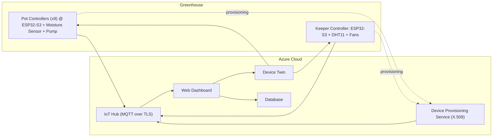
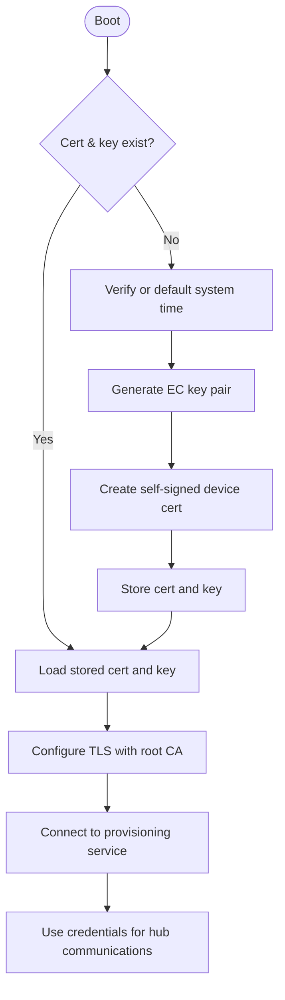
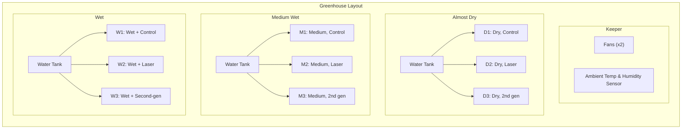

# Flows

## Simple system architecture

```mermaid
flowchart LR
 subgraph Greenhouse["Greenhouse"]
        Pots["Pot Controllers (x9) @ ESP32-S3 + Moisture Sensor + Pump"]
        Keeper["Keeper Controller: ESP32-S3 + DHT11 + Fans"]
  end
 subgraph AzureCloud["Azure Cloud"]
        DPS["Device Provisioning Service (X.509)"]
        IoTHub["IoT Hub (MQTT over TLS)"]
        DeviceTwin["Device Twin"]
        DB["Database"]
        Dashboard["Web Dashboard"]
  end
    Pots --> IoTHub
    Keeper --> IoTHub
    DPS --> IoTHub
    Pots -. provisioning .-> DPS
    Keeper -. provisioning .-> DPS
    IoTHub --> Dashboard
    DeviceTwin --> Pots & Keeper
    Dashboard --> DB & DeviceTwin
```

## Cert Gen and Provisioning

```mermaid
flowchart TD
    Start(["Boot"]) --> Check{"Cert & key exist?"}
    Check -- No --> Time["Verify or default system time"]
    Time --> GenKey["Generate EC key pair"]
    GenKey --> SelfSign["Create self‑signed device cert"]
    SelfSign --> Store["Store cert and key"]
    Check -- Yes --> Load["Load stored cert and key"]
    Store --> Load
    Load --> TLS["Configure TLS with root CA"]
    TLS --> Provision["Connect to provisioning service"]
    Provision --> Hub["Use credentials for hub communications"]
```

## Greenhouse layout

```mermaid
flowchart LR
 subgraph Keeper["Keeper"]
        Fans["Fans (x2)"]
        TempHum["Ambient Temp & Humidity Sensor"]
  end
 subgraph PotsDry["Almost Dry"]
        DR["Water Tank"]
        D1["D1: Dry, Control"]
        D2["D2: Dry, Laser"]
        D3["D3: Dry, 2nd gen"]
  end
 subgraph PotsMedium["Medium Wet"]
        MR["Water Tank"]
        M1["M1: Medium, Control"]
        M2["M2: Medium, Laser"]
        M3["M3: Medium, 2nd gen"]
  end
 subgraph PotsWet["Wet"]
        WR["Water Tank"]
        W1["W1: Wet + Control"]
        W2["W2: Wet + Laser"]
        W3["W3: Wet + Second-gen"]
  end
 subgraph Greenhouse["Greenhouse Layout"]
        Keeper
        PotsDry
        PotsMedium
        PotsWet
  end
    DR --> D1 & D2 & D3
    MR --> M1 & M2 & M3
    WR --> W1 & W2 & W3
```
